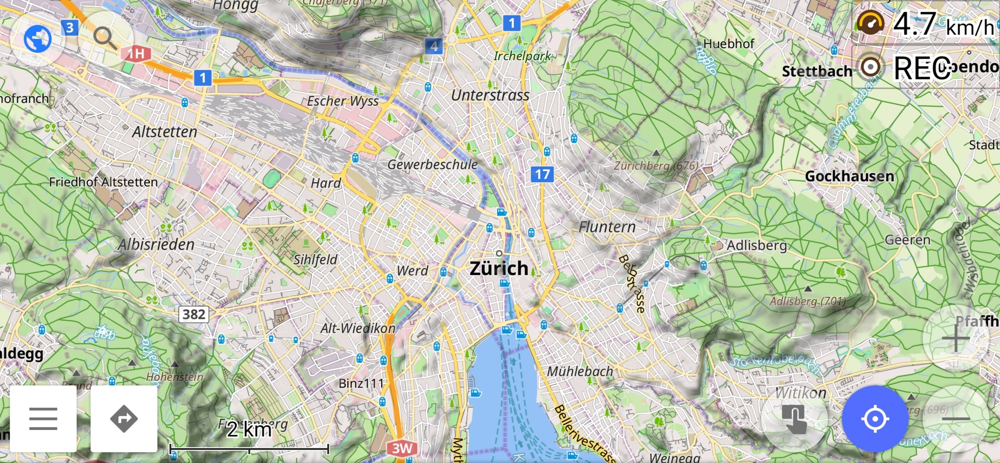

# OsmAnd Custom Map Styles

This repository intends to provide custom map styles created by users for users.
The map styles (or rendering styles) are Extensible Markup Language (.xml) files.

## How to Import Map Styles to OsmAnd

1. Download/ move the file onto your device.
2. Select "Open with"
3. Select "OsmAnd"
4. Done.
5. Select the map style within the app by
  1. Open hamburger menu
  2. Select "Configure map"
  3. Select "Map Style" in the category "Map rendering"

## Map Styles

### UniMap

- filename: UniMap.xml
- Description: Beautiful map colors without pop and too many colors.
- Mode: all-rounder. It can be used for any mode (car, bike, foot, ...).
- Notes:
  - [x] greenish background color (same as farmland)
  - [x] lighter green for forests
  - [x] lighter blue for water
  - [x] yellowish major roads, white medium roads and gray service roads
  - [ ] no random house numbers at zoom level 16 and 17
  - [ ] narrower street lighting
  - [ ] reduced importance of churches, camping sites
  - [ ] more area detail on lower zoom levels but increased rendering time
  - [ ] larger text size for regions

## How to contribute

Contributions are very welcome. You can either submit your own custom map style or improve an existing map style and create a pull request (PR).

## How to report a bug

If importing fails and returns and error, please [file an issue](https://github.com/basings/OsmAnd-custom-map-styles/issues/new). This should not happen since each published map style is tested but mistakes happen.

## License

The files are licensed under GPLv3 like their originals taken from https://github.com/osmandapp/OsmAnd-resources/tree/master/rendering_styles

## Other Styles I found online

- Railway Style: https://github.com/fuzzysolutions/OsmAndRailwayStyles
- Hiking: https://github.com/Hades1503/OsmAnd_Hiking_Map
